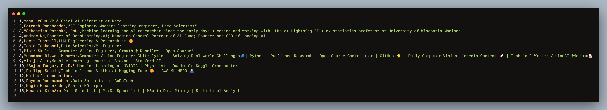

# ${LinkedIn\ Scrapper\ {\color{red}Selenium}}$

$${\color{orange}Asmr  \color{lightblue}C \color{orange}ode \color{lightblue}Z}$$

NOTE : 1. download lasted of chrome driver in this [LINK](https://chromedriver.chromium.org/downloads) . be careful > go to help of chrome and see version of Chrome , its very important webdriver version number same with chrome version number.

NOTE : 2. set ur username and password in [config.yml]() file in folder.

```yml
# Config.yml
USERNAME : ""
PASSWORD : ""
URL  : "https://www.linkedin.com/"
URL2 : "https://www.linkedin.com/mynetwork/"
PATH : "../00_WebDriver/chromedriver.exe"
COUNT: 100
TIME : 5
BotSkip : True
TIME_Bot_HANDLE : 20
EXPORT_FILE : "information.csv"
```

## $\textcolor{orange}{ScreanShot}$

$${\color{orange}Find \ Popular \ \color{yellow}Person \ in \ my \ network }$$


<!-- <div align="center">
  <kbd>
    
  </kbd>
</div> -->